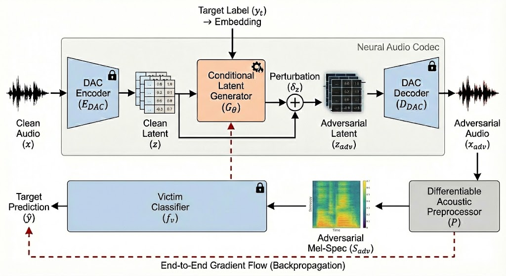
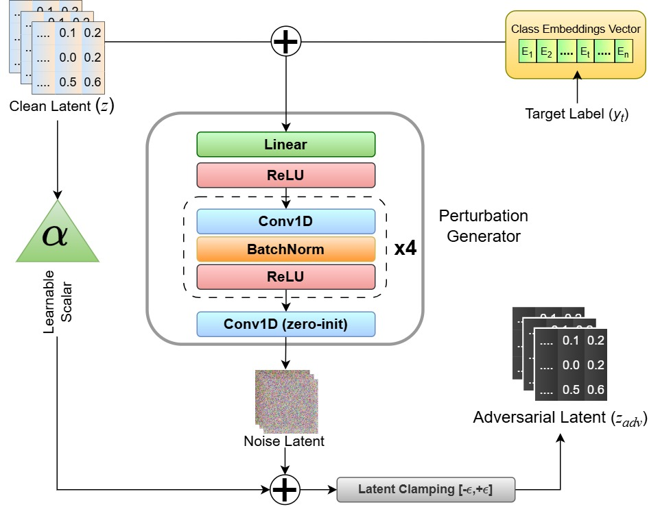

# Exploiting Neural Audio Codec Latents for Adversarial Audio Attacks

[](https://interspeech2026.org/en-AU)
[](https://vcbsl.github.io/lab-website/)
[]()
[]()

## Abstract

Deep learning–based audio classification systems, including automatic speaker verification, are highly vulnerable to adversarial attacks. Realistic real-time threat assessment remains challenging because most gradient-based attacks, such as projected gradient descent (PGD) and Carlini–Wagner, require costly optimization in the high-dimensional waveform domain. Generative attacks enable single-shot generation but often introduce perceptible artifacts or rely on heavy architectures, while diffusion and autoregressive methods incur substantial inference overhead.
To address this gap, we propose a generative attack framework operating in the continuous latent space of a neural audio codec. A conditional generator produces class-specific perturbations in a single forward pass and decodes them into adversarial waveforms. Our method achieves targeted attack success rates above $77\%$ (up to $99\%$) with sub-$7$\,ms inference, outperforming generative baselines while reducing latency by $24\times$.

---

## Architectural Overview



**Figure 1**: Architectural overview of the proposed end-to-end latent-space adversarial attack framework. The clean input waveform $x$ is first projected into a continuous, lower-dimensional manifold $z$ via the frozen DAC Encoder ($E_{DAC}$). The trainable conditional generator ($G_\theta$, highlighted in orange) synthesizes a targeted perturbation $\delta_z$ by fusing the pristine latent $z$ with the target class embedding $y_t$. The perturbed latent $z_{adv}$ is then reconstructed into the adversarial waveform $x_{adv}$ through the frozen DAC Decoder ($D_{DAC}$). To bridge the time-domain audio and the frozen victim classifier, a fully differentiable acoustic feature extractor ($\mathcal{P}$) is utilized. The dashed line illustrates the continuous gradient flow (backpropagation) from the victim classifier's composite loss all the way back to the latent generator, enabling single-shot, waveform-optimized attacks without relying on iterative inference-time optimization.

---

## Proposed Method

We propose a white-box generative adversarial framework operating entirely in the continuous latent space of a neural audio codec. As illustrated in Figure 1, the end-to-end differentiable generative pipeline comprises four components: (1) a frozen codec encoder mapping audio to latents; (2) a trainable conditional generator $G_\theta$; (3) a frozen codec decoder reconstructing waveforms; and (4) a fully differentiable acoustic preprocessor bridging the waveform to the frozen victim model $f_v$.

### Latent Projection and Conditional Generation

Let $x \in \mathbb{R}^{T}$ denote the raw audio waveform. The frozen Descript Audio Codec (DAC) encoder extracts a compressed, continuous latent representation:
$$z = E_{DAC}(x), \quad z \in \mathbb{R}^{C \times L}$$
where $C$ is the channel dimension and $L \ll T$. This structured manifold allows minimal displacements to induce maximal semantic shifts without introducing jagged, audible artifacts.

To achieve single-shot generation, we introduce a trainable feed-forward generator $G_\theta$ (Figure 2). It is conditioned on a target $t$, which can be a discrete class label $y_t$ (for classification) or a continuous speaker embedding $v_{tgt} \in \mathbb{R}^{D_{emb}}$ (for speaker verification). For ASV attacks, the embedding is linearly projected to match the latent sequence dimensions of the DAC, yielding an embedding $E_{tgt} \in \mathbb{R}^{C \times L}$.

The bounded adversarial latent is clamped to prevent gradient explosion and is formulated as follows:
$$\delta_z = \text{Clip}\big(G_\theta(z + E_{tgt}) + \alpha \cdot z, -\epsilon_{bnd}, \epsilon_{bnd}\big)$$
$$z_{adv} = \text{Clip}(z + \delta_z, -z_{max}, z_{max})$$



**Figure 2**: Detailed architecture of the Conditional Latent Generator ($G_\theta$). The network utilizes a multi-scale temporal receptive field (Conv1D) to process the fused continuous representation. A residual skip connection scaled by a learnable parameter $\alpha$ ensures training stability, while zero-initialization of the final layer guarantees negligible initial perturbation.

### Differentiable Decoding and Feature Extraction

The bounded latent sequence is passed through the frozen DAC decoder to reconstruct the adversarial waveform:
$$x_{adv} = D_{DAC}(z_{adv})$$
Because modern audio classifiers predominantly operate on frequency-domain features, we formulate a fully differentiable preprocessor $\mathcal{P}$. This module executes a Short-Time Fourier Transform (STFT), Mel-scale filterbank mapping, and logarithmic compression while preserving the computational graph. The resulting spectral feature map bridging the codec to the classifier is:
$$S_{adv} = \mathcal{P}(x_{adv}), \quad S_{adv} \in \mathbb{R}^{F_{mel} \times T_{frames}}$$

### Adversarial Objective Formulation

The overall objective is formulated as:
$$\mathcal{L}_{total} = \mathcal{L}_{adv} + \lambda_{m} \mathcal{L}_{margin}^k + \lambda_{L2} \frac{\lVert \delta_z \rVert_2}{B}$$
where $B$ is the batch size, and the $L_2$ regularization term explicitly bounds the continuous perturbation $\delta_z$ within the DAC latent space. The task-specific components, $\mathcal{L}_{adv}$ and $\mathcal{L}_{margin}^k$ (where $k \in \{cls, emb\}$), are defined according to the victim model's operational domain:

- **Discrete Categorical Objective**:
  $$\mathcal{L}_{margin}^{cls} = \max\Big(0, \max_{i \neq y_t} (\hat{y}_i) - \hat{y}_{y_t} + m_{cls}\Big)$$
  where $m_{cls}$ is a constant scalar margin enforcing strict separation between the target logit and the next most likely class.

- **Continuous Embedding Objective**:
  $$\mathcal{L}_{margin}^{emb} = \max\Big(0, \cos(v_{adv}, v_{src}) - \cos(v_{adv}, v_{tgt}) + m_{emb}\Big)$$
  where $m_{emb}$ dictates the requisite separation threshold in the cosine space.

---

## Repository Structure

```
github/
├── config/
│   └── config.py         # Hyperparameters, paths, and training configurations
├── models/
│   └── models.py         # StrongGenerator architecture + PANNs Cnn14 classifier
├── utils/
│   ├── dataset.py        # UrbanSound8K dataset loader
│   └── utils.py          # EMA, margin loss, scheduler, and seeding helpers
├── methods/
│   ├── fgsm.py           # Fast Gradient Sign Method (targeted & untargeted baselines)
│   ├── pgd.py            # Projected Gradient Descent (targeted & untargeted baselines)
│   └── cw.py             # Carlini & Wagner L2 (targeted & untargeted baselines)
├── train.py              # Main training and quick-evaluation script
├── requirements.txt      # Pinned environment requirements
├── .gitignore            # Excludes caches, weights, and logs
└── README.md             # This documentation
```

---

## Experimental Setup

### Datasets
We evaluate our adversarial attack generator on four benchmark datasets:
- **Google Speech Commands**: 35 one-second spoken words at 16 kHz (80,000 train / 4,273 test).
- **TAU Urban Acoustic Scenes 2019**: 10 urban scene classes with 10-second clips.
- **UrbanSound8k**: 10 environmental sound classes (Fold 5 used for testing).
- **LibriSpeech (train-clean-100)**: 251 speakers for speaker verification trials.

### Baselines & Victim Models
- **Attacks**: FGSM ($\epsilon=0.01$), PGD ($\epsilon=0.01, \alpha=0.01, 10\text{ steps}$), CW ($c=1, \text{lr}=0.01, 50\text{ steps}$), FAPG, and CGAN.
- **Victim Models**: Audio Spectrogram Transformer (AST), PANNs CNN14, and ECAPA-TDNN.

---

## Results and Discussion

### 1. Google Speech Commands Dataset (AST Model)

| Method | Untargeted Acc (%) | Untargeted ASR (%) | Targeted Acc (%) | Targeted ASR (%) | Time (sec per sample) |
|---|:---:|:---:|:---:|:---:|:---:|
| FGSM | 91.12 | 8.88 | 93.46 | 3.63 | 0.9511 |
| PGD | 54.35 | 45.65 | 85.81 | 12.63 | 2.4880 |
| CW | 22.40 | 77.60 | 32.69 | 66.22 | 13.2731 |
| FAPG | 18.92 | 82.08 | 3.53 | 80.77 | 0.0153 |
| CGAN | 5.15 | 93.72 | 6.42 | **93.56** | 0.0158 |
| **Ours** | **3.42** | **96.58** | **3.32** | 77.65 | **0.0067** |

### 2. Environmental Sound Classification Tasks (PANNs CNN14 Model)

#### UrbanSound8K Results
| Method | Untargeted Acc (%) | Untargeted ASR (%) | Targeted Acc (%) | Targeted ASR (%) | Time (sec per sample) |
|---|:---:|:---:|:---:|:---:|:---:|
| FGSM | 48.50 | 44.86 | 60.94 | 12.16 | 0.71 |
| PGD | 43.06 | 50.06 | 46.55 | 30.21 | 1.24 |
| CW | 4.70 | 94.67 | 14.37 | 92.21 | 6.14 |
| FAPG | 2.10 | 97.90 | 1.76 | 96.52 | 0.0048 |
| CGAN | 20.17 | 79.83 | 21.22 | 77.13 | 0.0237 |
| **Ours** | **0.89** | **99.11** | **1.23** | **97.17** | **0.0039** |

#### DCASE2019 Results
| Method | Untargeted Acc (%) | Untargeted ASR (%) | Targeted Acc (%) | Targeted ASR (%) | Time (sec per sample) |
|---|:---:|:---:|:---:|:---:|:---:|
| FGSM | 13.31 | 84.04 | 15.27 | 14.67 | 1.89 |
| PGD | 6.59 | 92.21 | 11.91 | 77.27 | 6.55 |
| CW | 0.31 | 99.84 | **0.24** | **96.65** | 38.55 |
| FAPG | 2.95 | 97.02 | 4.34 | 95.80 | 0.0097 |
| CGAN | 1.20 | 98.25 | 4.12 | 95.97 | 0.0232 |
| **Ours** | **0.00** | **100.00** | 0.32 | 94.07 | **0.0056** |

### 3. Speaker Verification (ECAPA-TDNN Model on LibriSpeech)

| Method | Untargeted Acc (%) | Untargeted ASR (%) | Targeted Acc (%) | Targeted ASR (%) | Time (sec per sample) |
|---|:---:|:---:|:---:|:---:|:---:|
| FGSM | 90.68 | 9.32 | 97.92 | 2.06 | 0.08 |
| PGD | 0.38 | 99.60 | 87.57 | 12.43 | 1.98 |
| CW | 0.03 | 99.95 | 17.45 | 82.64 | 66.2 |
| FAPG | 19.00 | 81.00 | 21.60 | 78.40 | 0.0836 |
| **Ours** | **0.00** | **100.00** | **0.02** | **99.80** | **0.0035** |

*Note: CGAN could not be evaluated due to mode collapse during training.*

---

## Conclusion

We introduce an end-to-end differentiable framework that generates adversarial examples directly in the continuous latent space of a neural audio codec, eliminating iterative inference-time optimization via a single forward pass. The method achieves targeted success rates of **97.17%** on UrbanSound8K and **77.65%** on Speech Commands in under **7\,ms** per sample—orders of magnitude faster than gradient-based baselines. These results highlight compressed semantic latent manifolds as a powerful and previously underexplored adversarial surface, enabling both high attack efficacy and real-time generation.

---

## Citation

```bibtex
@inproceedings{dacgan2026,
  title     = {Exploiting Neural Audio Codec Latents for Adversarial Audio Attacks},
  booktitle = {Proc. Interspeech 2026},
  year      = {2026}
}
```
